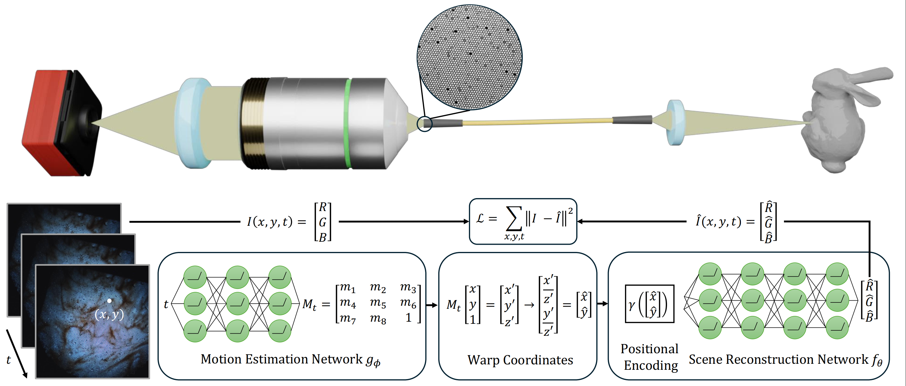
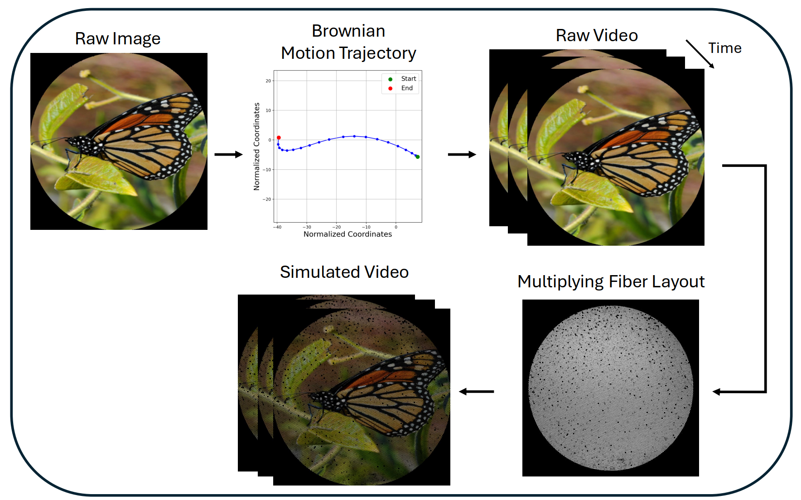
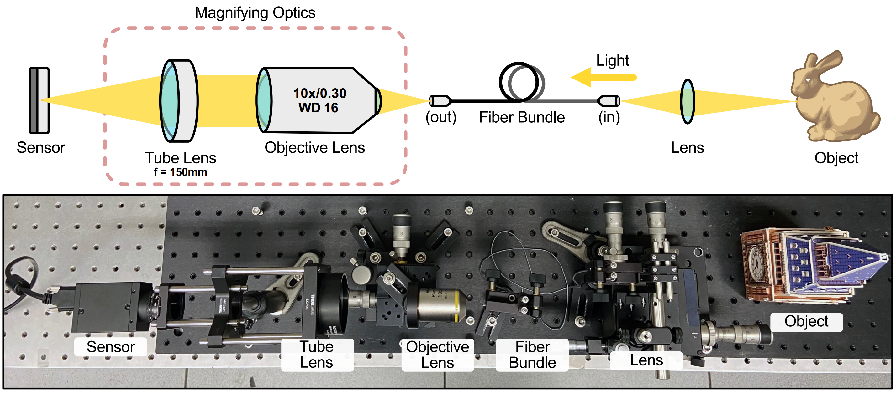

# Neural Field for Fiber Bundle Imaging

<p align="center">
  
</p>

---

## Overview

Fiber bundle imaging systems enable minimally invasive **in-vivo** imaging but suffer from sampling artifacts (e.g., honeycomb patterns) due to discrete and non-uniform fiber layouts.

This repository implements an **unsupervised test-time training method** for removing these artifacts from a burst of misaligned frames. Our approach requires **no ground truth, calibration, or prior knowledge of fiber geometry**. Instead, we leverage information from multiple frames in a burst—each frame reveals different parts of the scene occluded by the fiber mask in other frames.

### Key Components

Our method jointly optimizes two neural networks:
- **Motion network** ($g_\phi$): Models frame-to-frame transformations
- **Scene representation network** ($f_\theta$): Reconstructs a super-resolved canonical scene using coordinate-based implicit representation with positional encoding

---

## Method

Each input frame is modeled as a warped observation of a canonical scene. For each pixel coordinate $(x, y, t)$, the reconstructed RGB values are:

$$
\hat{I}(x, y, t) = [\hat{R}, \hat{G}, \hat{B}] = f_\theta\left(\gamma\left(T_{g_\phi}(x, y, t)\right)\right)
$$

where:
- $T_{g_\phi}$: motion transformation (e.g., homography or optical flow)
- $\gamma(\cdot)$: positional encoding
- $f_\theta$: scene representation network (MLP)

Both networks are trained jointly by minimizing the $\ell_2$ reconstruction loss:

$$
\mathcal{L} = \sum_{x, y, t} \left\lVert \hat{I}(x, y, t) - I(x, y, t) \right\rVert^2
$$

where:
- $I(x, y, t)$: observed RGB value at pixel $(x, y)$ in frame $t$
- $\hat{I}(x, y, t)$: reconstructed RGB value predicted by the model

**Note on positional encoding**: To mitigate spectral bias and improve reconstruction of high-frequency details, spatial coordinates are passed through positional encoding $\gamma(\cdot)$ before being mapped to RGB values by $f_\theta$.

---

## Reconstruction Examples

<p align="center">
  
</p>

---

## Repository Structure

- **`utils.py`** – Motion models and positional encoding utilities
- **`main.ipynb`** – Jupyter notebook for running reconstruction on new bursts
- **Ablation scripts** – Scripts for motion, encoding, and hyperparameter studies

---

## Usage

### 1. Prepare Input Data
Place burst frames in a folder, named sequentially:
```
0_000.png
1_000.png
2_000.png
...
{N-1}_000.png
```
where $N$ is the number of frames.

### 2. Run Reconstruction
Open and run `main.ipynb` in Google Colab or locally (A100 GPU recommended).

### 3. Configure Parameters
Select the following options in the notebook:
- **Motion model**: `Homography`, `Optical Flow with TV loss`, `Optical Flow w/o TV loss`, or `None`
- **Positional encoding**: `Fourier`, `Hash`, `NeRF`, `SIREN`, or `None`
- **Hyperparameters**: Encoding scale $\sigma$, learning rate, number of iterations, etc.

---

## Dataset

This repository provides both simulated and experimental datasets used in our fiber bundle imaging experiments. All data from our imaging setup is publicly available.

### Simulated Data

The simulated dataset was generated by:
1. Applying random Brownian motion to a raw image to produce 20 frames
2. Multiplying each frame by a fiber mask to emulate fiber bundle sampling characteristics

**Aligned ground truth images are provided** for all simulated sequences.

**Simulation pipeline:**

<p align="center">
  
</p>

### Experimental Data

Two experimental scenarios are included:

1. **2D Scene**: The same Brownian motion procedure used for simulated data was applied to generate 20 frames, displayed on a screen and captured using our imaging setup.

2. **3D Object**: The object was manually moved relative to the imaging probe to acquire 20 frames from different viewpoints.

**Experimental acquisition setup:**

<p align="center">
  
</p>

**Note:** Ground truth is not available for experimental data due to acquisition constraints. However, all misaligned raw images used in the experiments are included.

> **Attribution:** Video 6 (Resolution chart) in the experimental dataset is sourced from the *PyFibreBundle* repository:  
> https://github.com/MikeHughesKent/PyFibreBundle

---

## Contact

For questions or issues, please open an issue on GitHub or contact [amir.vazifeh@princeton.edu].